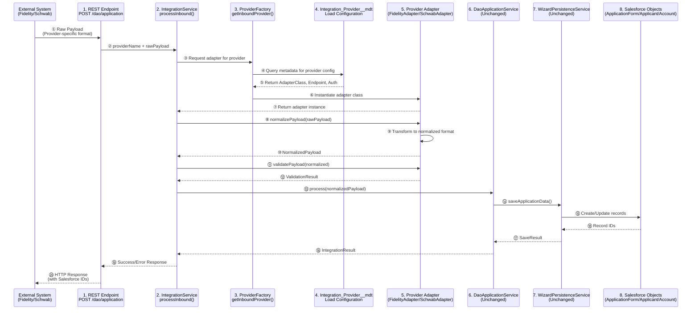
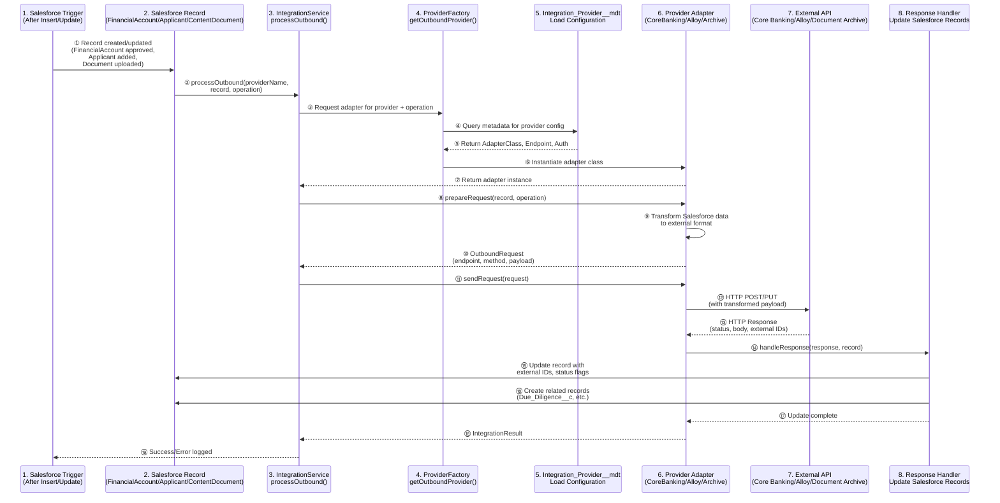
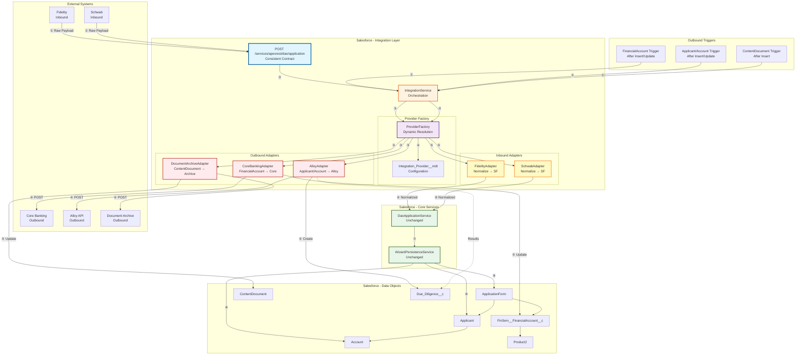

# ADR-0004: Bidirectional Integration Pattern with Provider Adapters

**Status**: Proposed  
**Date**: 2025-01-16  
**Decision Makers**: Development Team, DAO Accelerator Group  
**Related ADRs**: ADR-0002, ADR-0003

---

## Context

As we build the DAO accelerator, we need to support integrations with multiple external systems in both directions:

**Inbound Integrations** (External → Salesforce):
- Application data from various banking providers (Fidelity, Schwab, etc.)
- Each provider has different API formats and field mappings

**Outbound Integrations** (Salesforce → External):
- **Book to Core**: Post approved `FinServ__FinancialAccount__c` records to core banking systems
- **Alloy Assessments**: Send `Applicant`/`Account` data to Alloy for KYC/AML checks
- **Document Archiving**: Archive `ContentDocument` records to external document management systems
- **Product Sync**: Synchronize `Product2` records with external product catalogs

**Key Requirements**:
1. Maintain a **consistent integration contract** on the Salesforce side (never changes)
2. Isolate bank/provider-specific logic in adapters (not in core services)
3. Support bidirectional flows (inbound and outbound)
4. Enable new providers via configuration (metadata-driven)
5. Avoid Mulesoft retrofits - keep provider logic in Salesforce adapters

**Current State**:
- REST API pattern defined but not fully implemented
- Handler map pattern established for wizard steps (ADR-0003)
- Configuration-driven architecture in place (ADR-0002)
- No outbound integration patterns exist yet

---

## Decision

We will implement a **bidirectional provider adapter pattern** that:

1. **Defines consistent interfaces** for both inbound and outbound operations
2. **Isolates provider-specific logic** in adapter classes (one per provider/system)
3. **Uses custom metadata** to configure providers dynamically
4. **Maintains stable contracts** - Salesforce services never change when adding providers
5. **Supports multiple integration types** via operation enums

### Architecture Overview

#### Inbound Integration Flow (External → Salesforce)



#### Outbound Integration Flow (Salesforce → External)



#### Component Architecture Diagram



### Key Components

1. **Integration Interfaces**:
   - `IIntegrationProvider` - Base interface
   - `IInboundProvider` - Normalize external payloads to Salesforce format
   - `IOutboundProvider` - Transform Salesforce data to external format
   - `IBidirectionalProvider` - Supports both directions

2. **Integration Service**:
   - `IntegrationService` - Orchestrates inbound/outbound flows
   - Routes to appropriate provider adapters
   - Handles errors and logging

3. **Provider Factory**:
   - `ProviderFactory` - Dynamic provider resolution from metadata
   - Loads `Integration_Provider__mdt` records
   - Returns appropriate adapter instance

4. **Provider Adapters** (one per external system):
   - Inbound: `FidelityAdapter`, `SchwabAdapter`, etc.
   - Outbound: `CoreBankingAdapter`, `AlloyAdapter`, `DocumentArchiveAdapter`

5. **Custom Metadata**:
   - `Integration_Provider__mdt` - Provider configuration
   - Fields: ProviderName, ProviderType, AdapterClass, SupportedOperations, EndpointUrl, AuthConfig

6. **Integration Operations**:
   - Enum: `CREATE_APPLICATION`, `BOOK_TO_CORE`, `ASSESS_ALLOY`, `ARCHIVE_DOCUMENT`, `SYNC_PRODUCT`

---

## Rationale

### Pros

- **Consistent Contract**: Salesforce REST endpoint and services never change when adding providers
- **Provider Isolation**: Bank-specific logic contained in adapter classes, not core services
- **Bidirectional Support**: Same pattern works for inbound and outbound integrations
- **Configuration-Driven**: New providers added via metadata, minimal code changes
- **Testable**: Each adapter can be unit tested independently
- **Maintainable**: Aligns with existing MSB patterns (handler maps, metadata-driven)
- **Scalable**: Easy to add new providers or integration types
- **Avoids Mulesoft Retrofit**: Provider logic stays in Salesforce, not middleware

### Cons

- **Initial Complexity**: Requires more upfront design than direct integration
- **Adapter Boilerplate**: Each provider needs its own adapter class
- **Metadata Management**: Teams must understand custom metadata patterns
- **Error Handling**: Need robust error tracking across multiple systems

### Alternatives Considered

**Option A: Direct Integration in Core Services**
- Rejected because: Would require core service changes for each new provider, violates consistent contract principle

**Option B: Mulesoft as Integration Layer**
- Rejected because: Historical experience shows retrofits are problematic; prefer provider logic in Salesforce adapters

**Option C: Platform Events for All Integrations**
- Rejected because: REST endpoints needed for inbound; platform events better for async outbound, but not required for all cases

**Option D: Separate Services per Provider**
- Rejected because: Would duplicate 90% of logic; adapter pattern provides better code reuse

---

## Consequences

### Positive

- **New Providers**: Adding Fidelity, Schwab, or any new bank requires only:
  1. Create adapter class implementing `IInboundProvider`
  2. Add metadata record in `Integration_Provider__mdt`
  3. No changes to core services or REST endpoints

- **New Integration Types**: Adding Book to Core, Alloy, Document Archive requires:
  1. Create adapter class implementing `IOutboundProvider`
  2. Add trigger/platform event to initiate outbound flow
  3. Add metadata record
  4. No changes to existing adapters

- **Testing**: Each adapter can be tested in isolation with mock external systems

- **Maintenance**: Provider-specific issues isolated to their adapter classes

### Negative

- **Learning Curve**: Developers must understand adapter pattern and metadata configuration

- **Initial Setup**: More components to create upfront (interfaces, factory, service, metadata type)

- **Debugging**: Integration issues may span multiple layers (adapter → service → external system)

### Neutral

- **Code Volume**: More classes overall, but better organized and maintainable

- **Deployment**: Custom metadata must be included in deployment packages

---

## Implementation

### Phase 1: Foundation (Core Interfaces & Service)

1. **Create Integration Interfaces**:
   ```apex
   // IIntegrationProvider.cls
   public interface IIntegrationProvider {
       String getProviderName();
       IntegrationConfig getConfig();
   }
   
   // IInboundProvider.cls
   public interface IInboundProvider extends IIntegrationProvider {
       NormalizedPayload normalizePayload(String rawPayload);
       ValidationResult validatePayload(NormalizedPayload payload);
   }
   
   // IOutboundProvider.cls
   public interface IOutboundProvider extends IIntegrationProvider {
       OutboundRequest prepareRequest(SObject record, IntegrationOperation operation);
       OutboundResponse sendRequest(OutboundRequest request);
       void handleResponse(OutboundResponse response, SObject record);
   }
   ```

2. **Create IntegrationService**:
   ```apex
   public class IntegrationService {
       public static IntegrationResult processInbound(String providerName, String rawPayload);
       public static IntegrationResult processOutbound(String providerName, SObject record, IntegrationOperation operation);
   }
   ```

3. **Create ProviderFactory**:
   ```apex
   public class ProviderFactory {
       public static IInboundProvider getInboundProvider(String providerName);
       public static IOutboundProvider getOutboundProvider(String providerName, IntegrationOperation operation);
   }
   ```

4. **Create IntegrationOperation Enum**:
   ```apex
   public enum IntegrationOperation {
       CREATE_APPLICATION, UPDATE_APPLICATION,
       BOOK_TO_CORE, ASSESS_ALLOY, ARCHIVE_DOCUMENT, SYNC_PRODUCT
   }
   ```

### Phase 2: Custom Metadata Type

1. **Create `Integration_Provider__mdt`**:
   - `ProviderName__c` (Text, required)
   - `ProviderType__c` (Picklist: Inbound, Outbound, Bidirectional)
   - `AdapterClass__c` (Text, required) - Fully qualified class name
   - `SupportedOperations__c` (Long Text Area) - Comma-delimited operations
   - `EndpointUrl__c` (URL)
   - `AuthenticationType__c` (Picklist: OAuth, API_Key, Basic, Custom)
   - `AuthConfig__c` (Long Text Area) - JSON configuration
   - `IsActive__c` (Checkbox)

### Phase 3: Inbound Integration (Example: Fidelity)

1. **Update REST Endpoint**:
   ```apex
   @RestResource(urlMapping='/dao/application')
   global with sharing class DaoApplicationRestService {
       @HttpPost
       global static void processApplication() {
           String providerName = detectProvider(); // From header/metadata
           String rawPayload = RestContext.request.requestBody.toString();
           IntegrationResult result = IntegrationService.processInbound(providerName, rawPayload);
           // Return response
       }
   }
   ```

2. **Create FidelityAdapter**:
   ```apex
   public class FidelityAdapter implements IInboundProvider {
       public NormalizedPayload normalizePayload(String rawPayload) {
           // Transform Fidelity-specific format to normalized Salesforce format
       }
   }
   ```

3. **Add Metadata Record**:
   - ProviderName: "Fidelity"
   - ProviderType: "Inbound"
   - AdapterClass: "FidelityAdapter"
   - SupportedOperations: "CREATE_APPLICATION,UPDATE_APPLICATION"

### Phase 4: Outbound Integration (Example: Book to Core)

1. **Create FinancialAccount Trigger**:
   ```apex
   trigger FinancialAccountIntegration on FinServ__FinancialAccount__c (after insert, after update) {
       if (Trigger.isAfter && (Trigger.isInsert || Trigger.isUpdate)) {
           for (FinServ__FinancialAccount__c fa : Trigger.new) {
               if (fa.Stage__c == 'Approved' && !fa.Booked_To_Core__c) {
                   IntegrationService.processOutbound('CoreBanking', fa, IntegrationOperation.BOOK_TO_CORE);
               }
           }
       }
   }
   ```

2. **Create CoreBankingAdapter**:
   ```apex
   public class CoreBankingAdapter implements IOutboundProvider {
       public OutboundRequest prepareRequest(SObject record, IntegrationOperation operation) {
           FinServ__FinancialAccount__c fa = (FinServ__FinancialAccount__c) record;
           // Transform FinancialAccount to Core Banking API format
       }
       
       public void handleResponse(OutboundResponse response, SObject record) {
           // Update FinancialAccount with Core account ID
           // Set Booked_To_Core__c = true
       }
   }
   ```

3. **Add Metadata Record**:
   - ProviderName: "CoreBanking"
   - ProviderType: "Outbound"
   - AdapterClass: "CoreBankingAdapter"
   - SupportedOperations: "BOOK_TO_CORE"

### Phase 5: Additional Outbound Integrations

1. **AlloyAdapter** - For KYC/AML assessments
   - Trigger on Applicant/Account after insert/update
   - Creates/updates Due_Diligence__c records

2. **DocumentArchiveAdapter** - For document archiving
   - Trigger on ContentDocument after insert
   - Updates ContentDocument with archive metadata

3. **ProductSyncAdapter** - For product catalog sync
   - Trigger on Product2 after insert/update
   - Syncs with external product management system

### Phase 6: Error Handling & Logging

1. **Create `Integration_Error__c` Custom Object**:
   - `Provider_Name__c`
   - `Operation__c`
   - `Record_Id__c`
   - `Error_Message__c`
   - `Error_Details__c` (Long Text Area)
   - `Retry_Count__c`
   - `Status__c` (Failed, Retrying, Resolved)

2. **Add Error Logging to IntegrationService**:
   - Log all integration errors
   - Support retry logic
   - Alert on critical failures

**Affected Components:**
- New: `IntegrationService.cls`, `ProviderFactory.cls`, Integration interfaces
- New: Provider adapter classes (FidelityAdapter, CoreBankingAdapter, AlloyAdapter, etc.)
- New: `Integration_Provider__mdt` custom metadata type
- New: `Integration_Error__c` custom object
- Modified: `DaoApplicationRestService.cls` (use IntegrationService)
- New: Triggers for outbound integrations (FinancialAccount, Applicant, ContentDocument)
- Unchanged: `DaoApplicationService.cls`, `WizardPersistenceService.cls` (core services remain stable)

**Migration Required**: No (new pattern, no breaking changes)

---

## Compliance

Does this decision affect:
- [x] Security policies - External API authentication must be secure
- [x] Data privacy (PII) - PII data sent to external systems (Alloy, Document Archive)
- [x] Regulatory requirements - KYC/AML assessments (Alloy) must comply with regulations
- [x] Audit trails - Integration errors and operations must be logged

**Security Considerations**:
- All external API calls must use secure authentication (OAuth, API keys)
- PII data must be encrypted in transit
- Integration credentials stored in Named Credentials or encrypted custom metadata
- Audit logging for all outbound integrations

**Privacy Considerations**:
- Document archiving must comply with data retention policies
- Alloy assessments must handle PII according to privacy regulations
- External system access must be logged and auditable

---

## Architecture Diagram Details

The architecture is visualized in three complementary diagrams:

1. **Inbound Integration Flow** - Sequence diagram showing step-by-step flow from external systems to Salesforce
2. **Outbound Integration Flow** - Sequence diagram showing step-by-step flow from Salesforce to external systems
3. **Component Architecture Diagram** - Component view showing all system components and their relationships

### Inbound Flow (External → Salesforce) - Step-by-Step

**Steps ①-②: Request Reception**
- ① External system (Fidelity, Schwab, etc.) sends raw payload in provider-specific format to Salesforce REST endpoint
- ② `DaoApplicationRestService` receives request and extracts provider name from header/metadata

**Steps ③-⑦: Provider Resolution**
- ③ `IntegrationService.processInbound()` called with provider name and raw payload
- ④ `ProviderFactory.getInboundProvider()` queries `Integration_Provider__mdt` for provider configuration
- ⑤ Metadata returns adapter class name, endpoint URL, and authentication configuration
- ⑥ Factory instantiates the appropriate adapter class (e.g., `FidelityAdapter`, `SchwabAdapter`)
- ⑦ Adapter instance returned to `IntegrationService`

**Steps ⑧-⑫: Payload Normalization**
- ⑧ `IntegrationService` calls `adapter.normalizePayload(rawPayload)`
- ⑨ Adapter transforms provider-specific format to normalized Salesforce format
- ⑩ Normalized payload returned to `IntegrationService`
- ⑪ `IntegrationService` calls `adapter.validatePayload(normalized)` for validation
- ⑫ Validation result returned (success or errors)

**Steps ⑬-⑳: Data Persistence**
- ⑬ `IntegrationService` calls `DaoApplicationService.process(normalizedPayload)`
- ⑭ `DaoApplicationService` calls `WizardPersistenceService.saveApplicationData()`
- ⑮ `WizardPersistenceService` creates/updates Salesforce records (ApplicationForm, Applicant, Account)
- ⑯ Record IDs returned from Salesforce DML operations
- ⑰ `SaveResult` returned to `DaoApplicationService`
- ⑱ `IntegrationResult` returned to `IntegrationService`
- ⑲ Success/Error response returned to REST endpoint
- ⑳ HTTP response sent back to external system with Salesforce record IDs

### Outbound Flow (Salesforce → External) - Step-by-Step

**Steps ①-②: Trigger & Service Invocation**
- ① Salesforce trigger fires on record change (FinancialAccount approved, Applicant added, ContentDocument uploaded)
- ② `IntegrationService.processOutbound()` called with provider name, Salesforce record, and operation type

**Steps ③-⑦: Provider Resolution**
- ③ `ProviderFactory.getOutboundProvider()` called with provider name and operation
- ④ Factory queries `Integration_Provider__mdt` for provider configuration matching operation
- ⑤ Metadata returns adapter class name, endpoint URL, and authentication configuration
- ⑥ Factory instantiates the appropriate adapter class (e.g., `CoreBankingAdapter`, `AlloyAdapter`, `DocumentArchiveAdapter`)
- ⑦ Adapter instance returned to `IntegrationService`

**Steps ⑧-⑬: Request Preparation & Transmission**
- ⑧ `IntegrationService` calls `adapter.prepareRequest(record, operation)`
- ⑨ Adapter transforms Salesforce data to external system format
- ⑩ `OutboundRequest` returned with endpoint, HTTP method, and transformed payload
- ⑪ `IntegrationService` calls `adapter.sendRequest(request)`
- ⑫ Adapter sends HTTP POST/PUT request to external API with transformed payload
- ⑬ External API returns HTTP response with status code, response body, and external system IDs

**Steps ⑭-⑲: Response Handling**
- ⑭ `IntegrationService` calls `adapter.handleResponse(response, record)`
- ⑮ Adapter updates Salesforce record with external IDs and status flags (e.g., `Booked_To_Core__c = true`)
- ⑯ Adapter creates related records if needed (e.g., `Due_Diligence__c` for Alloy assessments)
- ⑰ Update operations complete
- ⑱ `IntegrationResult` returned to `IntegrationService`
- ⑲ Success/Error logged to `Integration_Error__c` for monitoring and retry logic

### Key Design Principles

- **Separation of Concerns**: Provider logic isolated in adapters
- **Open/Closed Principle**: Open for extension (new providers), closed for modification (core services)
- **Dependency Inversion**: Core services depend on interfaces, not concrete adapters
- **Configuration over Code**: Providers configured via metadata, not hardcoded

---

## References

- `/docs/01-foundation/ARCHITECTURE.md` - Configuration-driven wizard pattern
- `/docs/04-implementation/architecture-decisions/ADR-0002-configuration-driven-wizard.md` - Metadata-driven approach
- `/docs/04-implementation/architecture-decisions/ADR-0003-step-handler-map-pattern.md` - Handler pattern inspiration
- `/force-app/main/default/classes/patterns/REST-API-Pattern.md` - REST API pattern
- `/docs/01-foundation/data-model.md` - Data model and object relationships

**Related Discussions**:
- DAO Accelerator Group - Integration strategy discussion (2025-01-16)
- Michael Parker - Consistent integration contract proposal

---

**Created**: 2025-01-16  
**Last Updated**: 2025-01-16  
**Review Date**: 2025-04-16

